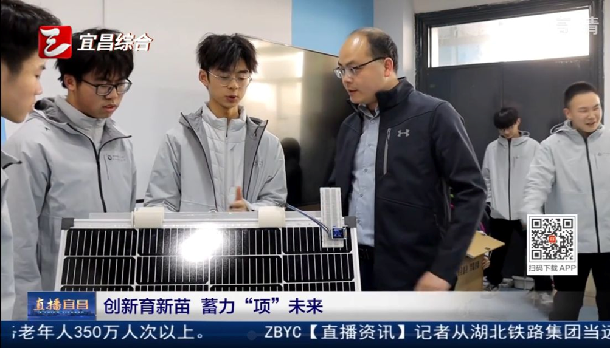
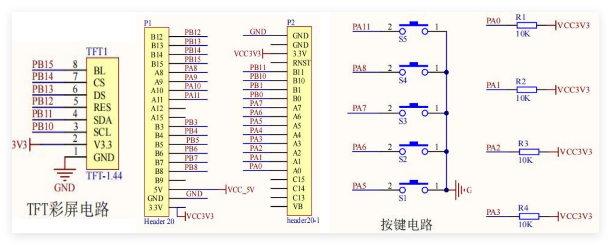
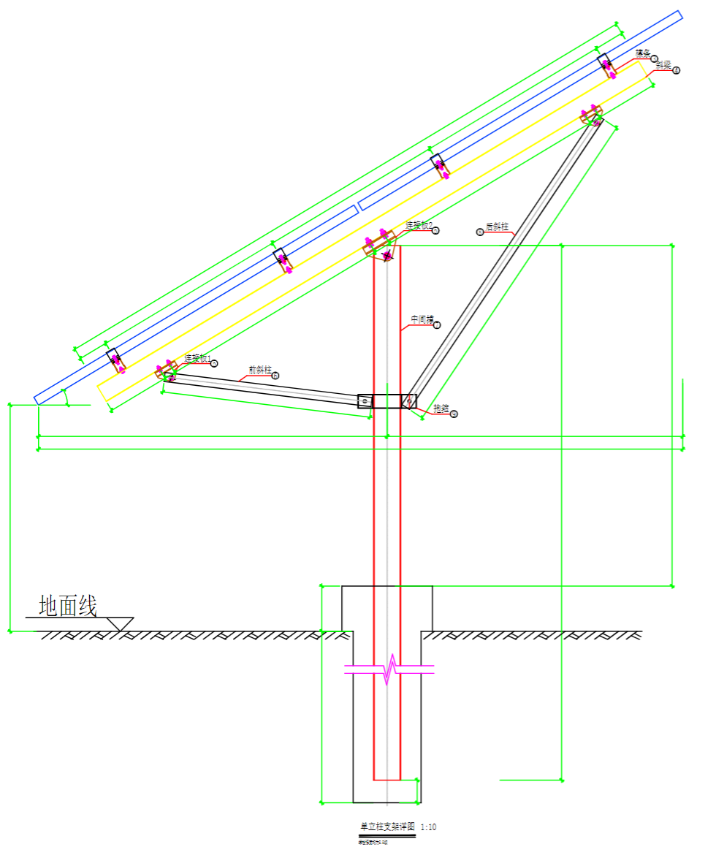
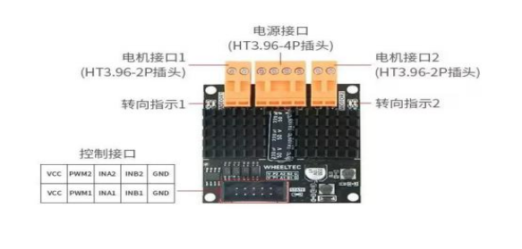
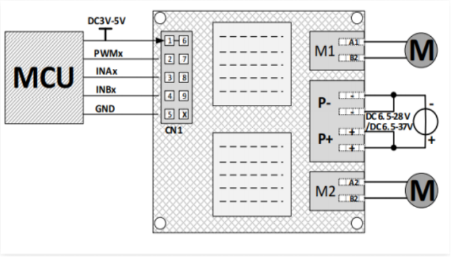
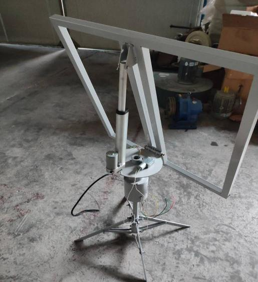
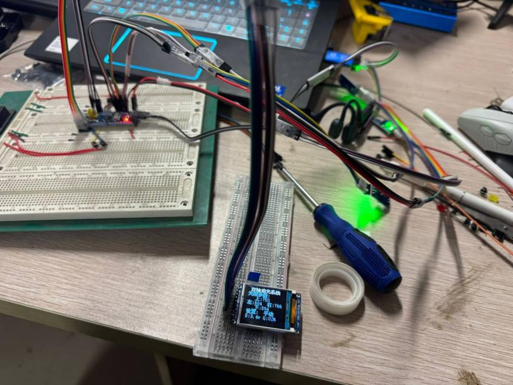
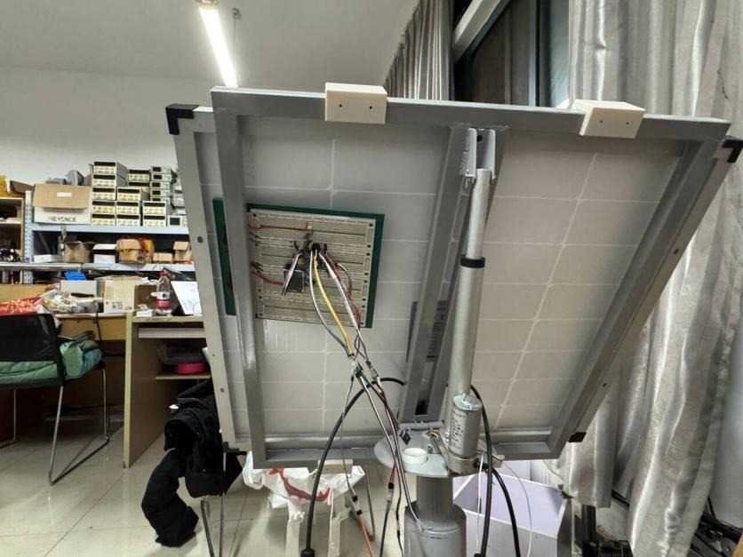

# 2D Solar Tracking System



基于 STM32F103C8T6 的双轴太阳能光伏追踪支架实验项目。系统通过四路光敏电阻采集上、下、左、右方向的光照强度，比较差值后驱动两个方向的电机调整光伏板姿态，使光伏板尽量朝向光照更强的方向。

本仓库整理自课程项目代码和报告资料，README 已去除姓名、学号、班级等个人信息，仅保留开源阅读所需的工程说明、关键图片和复现线索。

## 项目特性

- 双轴追光：分别根据左右、上下光照差值控制两个运动方向。
- 自动/手动模式：自动模式按光照差值追踪，手动模式通过按键控制运动。
- TFT 显示：1.44 寸 TFT 屏显示四路光照采样值、当前模式和电池电量。
- 电池监测：通过 ADC 采集电池电压，并换算为容量百分比显示。
- Keil 工程：工程文件位于 `USER/A-Test.uvprojx`，目标芯片为 STM32F103C8。

## 系统结构

系统主要由主控、电源、传感、执行和显示/交互几部分组成：

- 主控：STM32F103C8T6 最小系统板。
- 传感：四路光敏电阻模块，分别放置在光伏板上、下、左、右方向。
- 执行：双通道直流有刷电机驱动器和两路运动机构。
- 显示：1.44 寸 TFT 彩屏，驱动 IC 为 ST7735。
- 电源：太阳能板、太阳能控制器、蓄电池和稳压/供电模块。
- 输入：5 个按键，用于模式切换和手动方向控制。



## 机械与电源方案

支架采用双自由度结构：一个方向负责左右旋转，另一个方向负责俯仰调整。光伏板采集光能后，经太阳能控制器给蓄电池储能；控制板和电机驱动板从电源链路中取电。







## 控制逻辑

当前固件入口在 `USER/main.c`。核心流程如下：

1. 初始化 ADC、按键、电机和 TFT 显示。
2. 持续读取 `ADC_convered[0..4]`。
3. 将四路光照 ADC 值换算到 `0-1000` 范围。
4. 自动模式下比较左右、上下两组光照差值。
5. 差值超过容差 `50` 时驱动对应方向电机。
6. 手动模式下通过按键控制上、下、左、右运动。
7. 计算并显示电池电压和容量估算值。

注意：报告原方案写的是上电默认自动模式；当前代码中 `setMode = 0`，并且显示逻辑中 `0` 对应手动、`1` 对应自动。如需上电自动追光，可将 `USER/main.c` 中的初始值改为：

```c
unsigned char setMode = 1;
```

## 主要引脚

| 功能 | 当前代码中的引脚/通道 |
| --- | --- |
| 左光照 | ADC1 Channel 0 / PA0 |
| 上光照 | ADC1 Channel 1 / PA1 |
| 右光照 | ADC1 Channel 2 / PA2 |
| 下光照 | ADC1 Channel 3 / PA3 |
| 电池电压 | ADC1 Channel 4 / PA4 |
| 按键 1-5 | PA5, PA6, PA7, PA8, PA11 |
| TFT | PB10-PB15 |
| 电机方向控制 | PB3-PB6 |

## 工程目录

```text
CORE/              CMSIS 内核文件和启动文件
HARDWARE/          ADC、按键、LCD、电机等硬件驱动
STM32F10x_FWLib/   STM32F10x 标准外设库
SYSTEM/            延时、GPIO、串口、系统辅助模块
USER/              Keil 工程、main.c、STM32 配置与中断文件
docs/images/       README 使用的关键图片
clear.bat          清理 Keil 编译中间文件
```

## 编译与烧录

1. 安装 Keil uVision5，并准备 STM32F10x 相关芯片支持包。
2. 打开 `USER/A-Test.uvprojx`。
3. 选择 `Target 1`，确认目标芯片为 `STM32F103C8`。
4. 执行 Build。
5. 使用 ST-LINK、J-Link 或项目中配置的下载器烧录到开发板。

如需清理编译产物，可运行：

```powershell
.\clear.bat
```

## 实物与调试







## 当前状态

- 已整理 `.gitignore`，默认忽略 Keil 编译产物和本机调试配置。
- README 图片已从报告中筛选并重新保存，未保留图片元数据。
- 仓库暂未声明开源许可证；正式发布前建议补充 `LICENSE`，并确认第三方库、示例驱动和图片素材的授权边界。
